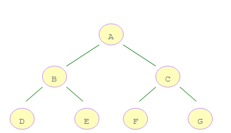

# 二叉树后序遍历
二叉树的后续遍历为左右根，即先遍历左子树节点 ---> 再遍历右子树节点 ---> 最后遍历根节点

以下图为例，则输出的结果为 D,E,B,F,G,C,A



## 递归求解
使用递归求解需要满足以下三个条件：
- 一个问题可以拆解为若干个子问题
- 每个子问题的求解，除了数据规模不同意外，其他相同
- 存在终止条件

二叉树的后序遍历的递归公式为
```
postOrder(node) = postOrder(node.left)--->postOrder(node.right)--->console.log(node.val)
```

终止条件为 node 为空，所以满足递归求解的条件，具体代码参考如下
```js
const postOrderTree = (root) => {
  
  const res = [];

  const postOrder = (node) => {
    if(!node) return;

    postOrder(node.left);
    postOrder(node.right);
    res.push(node.val);
  }

  postOrder(root);

  return res;
}

```